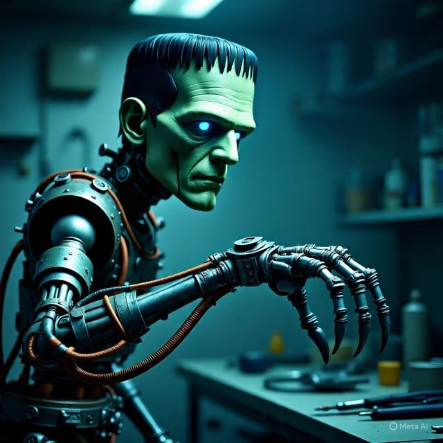

<p align="center">
    
</p>

<h1 align="center">Frank Robot</h1>
<h3 align="center">MuJoCo Simulation & Dynamic Performance Analysis</h3>

<p align="center">
    <em>A MuJoCo-based robotic arm simulation with inverse dynamics control and performance analysis under varying load conditions.</em>
</p>

<p align="center">
    <a href="https://gianvstheworld.github.io/frank/">📊 Live Visualizer</a> — <em>View episode metrics and visualizations directly from Hugging Face datasets</em>
</p>

---

## 🚀 Get Started

This project provides a complete simulation environment for the Frank robot manipulator using MuJoCo physics engine. The system implements **jointspace inverse dynamics control** and includes tools for analyzing robot performance under various external forces and load conditions.

**Key Features:**
- 4-DOF robotic arm simulation with MuJoCo
- Inverse dynamics controller with PD feedback
- External force application and logging
- Comprehensive performance analysis (RMS error, overshoot, settling time, torque analysis)
- LeRobot dataset visualizer for exploring recorded trajectories

## 📦 Installation

### Prerequisites

1. Ensure you have the **MuJoCo 2.10** binaries installed in `~/.mujoco/mujoco210`. Follow the [installation guide](https://gist.github.com/saratrajput/60b1310fe9d9df664f9983b38b50d5da) for detailed instructions.

### Setup

1. Clone the repository:
    ```bash
    git clone https://github.com/gianvstheworld/frank.git
    cd frank
    ```

2. Run the installation script:
    ```bash
    ./install_mujoco.sh
    ```

3. Activate the Conda environment:
    ```bash
    conda activate mujoco_py
    ```

4. Set required environment variables (add to your `.bashrc` or `.zshrc` for persistence):
    ```bash
    export LD_LIBRARY_PATH=$LD_LIBRARY_PATH:$HOME/.mujoco/mujoco210/bin:/usr/lib/nvidia
    export LD_PRELOAD=/usr/lib/x86_64-linux-gnu/libGLEW.so.2.2
    ```

## 💡 Examples of Usage

### Running the Simulation

Execute the main simulation script:

```bash
python frank_simple_inverse_dynamics.py
```

**Simulation Controls:**
| Key | Action |
|-----|--------|
| Arrow Keys | Move robot along X/Y axes |
| Keypad 0/1 | Move robot along Z axis |
| Mouse Left Click | Actuate/Apply force |

The simulation runs for 10 seconds executing a sinusoidal trajectory while applying external forces during the middle third of the simulation. Data is automatically logged to `simulations_data/`.

### Analyzing Simulation Results

After running simulations, analyze the results using:

```bash
python analysis.py
```

This generates comprehensive performance metrics including:
- RMS tracking error per joint
- Peak and mean torque values
- Overshoot percentage
- Settling time and rise time
- Steady-state error
- Integral Absolute Error (IAE)

## 📁 Code Structure

```
frank/
├── frank_simple_inverse_dynamics.py  # Main simulation with inverse dynamics controller
├── analysis.py                       # Performance metrics analysis module
├── analysis_from_lerobot.py          # Analysis for LeRobot format data
├── frank_lerobot_recorder.py         # Recording interface for LeRobot datasets
├── run_lerobot_experiment.py         # Experiment runner for LeRobot
├── install_mujoco.sh                 # MuJoCo installation script
├── assets/
│   └── frank-robot.xml               # MuJoCo model definition
├── simulations_data/                 # Output directory for simulation logs
├── lerobot_data/                     # LeRobot format dataset storage
└── visualizer/                       # Next.js web app for dataset visualization
    ├── src/
    │   ├── app/
    │   └── components/
    └── package.json
```

## 👥 Authors

- Felipe Tommaselli
- Gianluca Capezzuto
- Pedro Hodge
- Sebastian Ardiles

## 📚 Academic Information

This project was developed as the **final project** for the **Robotic Manipulation** course.

### Course Details
- **Course:** Robotic Manipulation
- **Semester:** 2nd Semester of 2025

## 📄 License

This project is licensed under the MIT License - see the [LICENSE](LICENSE) file for details.

---
